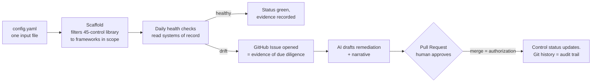

# Compliance Program — an agentic, controls-as-code GRC engine

[](https://github.com/tiffanidickerson437-lang/compliance-program/actions/workflows/scaffold.yml)
[](https://github.com/tiffanidickerson437-lang/compliance-program/actions/workflows/evidence-validator.yml)
[](https://github.com/tiffanidickerson437-lang/compliance-program/actions/workflows/strm-lint.yml)
[](https://github.com/tiffanidickerson437-lang/compliance-program/actions/workflows/fair-simulation.yml)
[](https://github.com/tiffanidickerson437-lang/compliance-program/actions/workflows/policy-tests.yml)
[](https://github.com/tiffanidickerson437-lang/compliance-program/actions/workflows/codeql.yml)

A compliance program that lives in Git and runs itself. **AI agents draft — control narratives,
drift triage, gap analyses. A human holds the veto on everything that becomes record. Evidence
is the exception: computed from systems of record, never AI-generated — the schema rejects it.**

Controls are defined once, evidenced once, and rendered into every framework and every audience
from a single source of truth. Compliance built for the audit is a tax; built for the business,
it is infrastructure. This is the second kind.



Read in one line: **code decides pass or fail, systems of record supply the evidence, AI drafts
the words, a human approves before anything becomes record.**

---

## What you're looking at, in 30 seconds

| Capability | Where | Machine-checked by |
|---|---|---|
| **45-control Living Control Set**, SCF 2026.1-mapped, OSCAL-native (catalog + 12 profiles + SSP all pass validation) | [`02-controls/`](02-controls/) | [Scaffold CI](.github/workflows/scaffold.yml) — 70 OSCAL checks |
| **11 controls specified at audit depth** — assessment objectives, EXAMINE/INTERVIEW/TEST methods, field-level evidence schemas | [`02-controls/controls/`](02-controls/controls/) | evidence schemas in CI |
| **FAIR Monte Carlo risk quantification** — loss-exceedance curves, ALE p50/p90/p95, no point estimates | [`tools/fair_montecarlo.py`](tools/fair_montecarlo.py) → [report](generated/fair-simulation-report.md) | [FAIR Simulation CI](.github/workflows/fair-simulation.yml) |
| **Set-theory framework mapping (STRM)** — 5 relationship types, linted; per-framework coverage % computed, not asserted | [`mappings/`](mappings/) → [coverage report](generated/framework-coverage.md) | [STRM Lint CI](.github/workflows/strm-lint.yml) |
| **Policy-as-code** — Rego rules with a Python fallback, allow/deny fixtures | [`policy/`](policy/) | [Policy Tests CI](.github/workflows/policy-tests.yml) |
| **Evidence gateways over MCP** — drift signals from Jira/AWS/GitHub, fixture fallback, `ai_generated: true` rejected by schema | [`.mcp.json`](.mcp.json), [`06-evidence-and-audit/`](06-evidence-and-audit/) | [Evidence Validator CI](.github/workflows/evidence-validator.yml) |
| **Governed AI workspace** — hooks that *block* AI-authored evidence and pushes to main at the tool level | [`.claude/`](.claude/) | [Policy Tests CI](.github/workflows/policy-tests.yml) |

> **How it was built:** the entire engine was constructed by directing AI agents under the same
> governance the program itself prescribes — AI drafted every unit, a human approved every merge.
> The build story: [**How I built this with AI**](docs/how-i-built-this-with-ai.md).

---

## The one hard rule

AI drafts narratives, remediations, and analyses. **AI never authors evidence.** Evidence is
computed deterministically from systems of record, and the pipeline enforces it three ways:

1. The evidence schema rejects `ai_generated: true` — [validated in CI](.github/workflows/evidence-validator.yml).
2. A pre-tool-use hook blocks any AI edit that writes `ai_generated: true` under an evidence path ([`.claude/hooks/guard_evidence.py`](.claude/hooks/guard_evidence.py)).
3. Drift findings arrive as timestamped GitHub Issues opened by the monitor — the Issue *is* the due-diligence record, not a narrative about one.

That boundary is the difference between leverage and an audit finding, and holding it is the
judgment this program is built to demonstrate.

---

## The eight pillars

| # | Pillar | Purpose |
|---|--------|---------|
| 00 | [Governance](00-governance/) | Charter, policy hierarchy, RACI, risk appetite, exceptions — where authority sits. |
| 01 | [Risk management](01-risk-management/) | FAIR-quantified scenarios in business terms; the register feeds the roadmap. |
| 02 | [Controls](02-controls/) | The engine. One control defined once; every framework gets a view, never a copy. |
| 03 | [Third-party risk](03-tprm/) | Diligence tiered to vendor access; trust evidence reused, not re-collected. |
| 04 | [AI governance](04-ai-governance/) | Autonomous agents on real-time location and minors' data: identity, least privilege, human gates. |
| 05 | [Secure development](05-secure-development/) | SDLC gates that produce evidence as a byproduct of shipping. |
| 06 | [Evidence and audit](06-evidence-and-audit/) | Evidence pre-validated continuously; audit-readiness as a state, not a sprint. |
| 07 | [Stakeholder management](07-stakeholder-management/) | One posture, rendered into the language each audience speaks. |

Cross-cutting: [`tools/`](tools/) (the executables), [`policy/`](policy/) (Rego + Python fallback),
[`mappings/`](mappings/) + [`frameworks/`](frameworks/) (STRM crosswalks), [`ai/`](ai/) (prompt
templates and the [AI usage policy](ai/AI-USAGE.md)), [`generated/`](generated/) (committed,
re-renderable output), [`30-60-90/`](30-60-90/) (discover → design → operate plan),
[`.github/workflows/`](.github/workflows/) (the CI that proves all of it).

---

## Run it yourself

Python 3 + `pip install -r requirements.txt`. No API keys, no external services — everything
below runs against what is committed here.

```bash
# Render the program from one config file
python3 tools/scaffold.py config.example.yaml

# Quantify the risk register: Monte Carlo → loss-exceedance curve → ALE percentiles
python3 tools/fair_montecarlo.py

# Lint the framework mappings and compute coverage (e.g. ISO/IEC 42001)
python3 tools/strm_lint.py && python3 tools/strm_coverage.py

# Validate the OSCAL layer: catalog, 12 profiles, and the SSP
python3 tools/validate_oscal.py

# Run the policy-as-code suite (works with or without OPA installed)
python3 policy/policy_test.py

# Draft an auditor narrative with AI — dry-run, no key, no network
python3 tools/draft_narrative.py --control CHG-02 --dry-run

# Compute control health; renders the GitHub Issue the drift monitor would open
python3 tools/check_control_health.py
```

The first five are CI gates — the badges at the top of this page are exactly these commands
running on pull requests. The health check also runs on a schedule as the drift monitor, which
opens the Issue for real ([example](https://github.com/tiffanidickerson437-lang/compliance-program/issues/18)).

---

## One config file drives everything

Copy [`config.example.yaml`](config.example.yaml) to `config.yaml`, set real values, re-run the
scaffold, and the program re-renders. Adding a framework is a mapping, never a new control set.

| Field | What it drives |
|-------|----------------|
| `frameworks` | Filters the control library and crosswalk to the regimes in scope. |
| `data-types` | Turns on mandatory families — `minors` → verifiable parental consent (PRI-03.13); `precise-location` → agent authorization (AAT-01). |
| `ai-products` | Turns on the AI-governance pillar, OWASP LLM Top 10 set, NIST AI RMF + ISO 42001 crosswalks. |
| `stack` | Names the evidence source systems and drift-check endpoints. |
| `risk.appetite` | Seeds tolerance bands in the risk register. |

The example config describes an illustrative consumer location-safety service processing minors'
data. It makes no claim about any real organization's posture.

---

## Guardrails

- Evidence is computed from systems of record; AI-generated content presented as evidence is
  rejected by schema and blocked by hook.
- Accountability attaches to functions and roles, never to named individuals.
- Example evidence is illustrative — replace it with computed exports before any audit use.
- No claim is made about any real organization's internal security posture.

## License

**[PolyForm Noncommercial 1.0.0](LICENSE)** — read, run, and evaluate freely; commercial use
requires permission. Copyright © 2026 Tiffani Dickerson.
